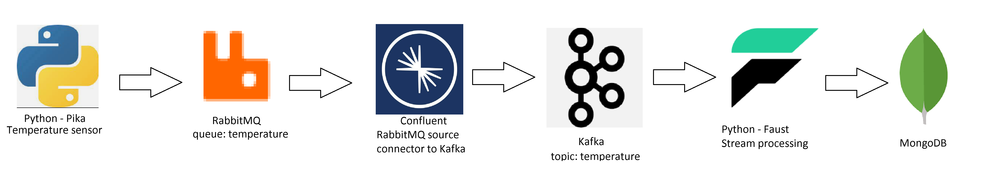

Project made for Computer Systems Management class
Author: Sebastian Kokoszka

Topic: Dockerized application with mock tempearture sensor, RabbitMQ, Kafka, stream processing and MongoDB

1. temperature_sensor.py generates mock temperature data every second and sends it RabbitMQ queue 'temperature'
2. RabbitMQ Source Connector subscribes to queue 'temperature' and sends data to Kafka topic 'temperature'
3. Faust agent calcuates moving average (of 5 records) and saves it to MongoDB